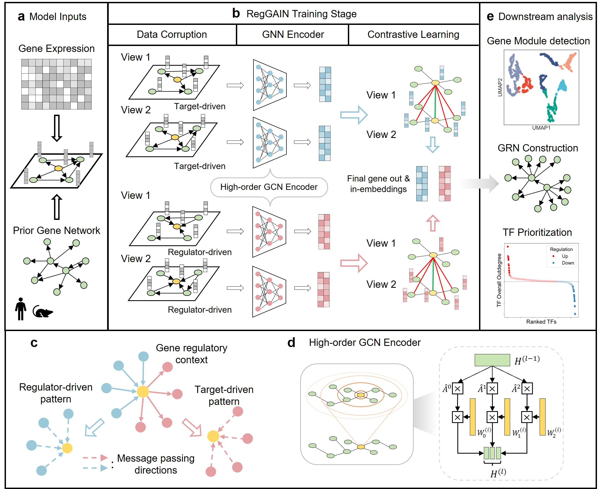

# RegGAIN: Inferring gene regulatory networks from single-cell RNA sequencing data by dual-role graph contrastive learning
---
## Introduction
---
`RegGAIN` is a self-supervised graph contrastive learning framework for inferring GRNs by integrating scRNA-seq data with species-specific prior networks.


## Installation
---

### Requirements
---
`RegGAIN` depends on the following Python packages:
```
'numpy>=1.26.4',
'pandas>=2.2.2',
'anndata>=0.10.9',
'scanpy>=1.10.2',
'matplotlib>=3.9.2',
'scikit-learn>=1.5.1',
'torch>=2.4.0',
'torch_geometric>=2.5.3',
'tqdm>=4.66.5',
'networkx>=3.2.1',
```
For better performance, we recommend running RegGAIN on an NVIDIA GPU with CUDA support to leverage GPU acceleration.
### Create a new conda environment
```
conda create -n RegGAIN python=3.9
conda activate RegGAIN
```
### Install using pip
```
pip install git+http://github.com/SDU-Math-SunLab/RegGAIN.git
```

## Usage example
---
### RegGAIN Inputs
- `scRNA-deq data`: Either a .csv file where rows correspond to cells and columns correspond to genes, or an .h5ad file containing AnnData objects.
- `Prior gene network`: A network file in edgelist format. We provide prior networks of NicheNet for both human and mouse species, which can be found in the /Data directory.

### Command line usage
```
reggain [-h] --exp_data EXP_DATA --prior_net PRIOR_NET [--output_dir OUTPUT_DIR] [--epochs EPOCHS] [--lr LR] [--device {cpu,cuda}] [--repeat REPEAT] [--seed SEED] [--k K]
        [--adjacency_powers ADJACENCY_POWERS [ADJACENCY_POWERS ...]] [--first_layer_dims FIRST_LAYER_DIMS [FIRST_LAYER_DIMS ...]] [--hidden_layer_dims_list HIDDEN_LAYER_DIMS_LIST] [--pos POS][--edge_alpha1 EDGE_ALPHA1] [--edge_alpha2 EDGE_ALPHA2] [--edge_beta1 EDGE_BETA1] [--edge_beta2 EDGE_BETA2] [--node_alpha1 NODE_ALPHA1] [--node_alpha2 NODE_ALPHA2] [--node_beta1 NODE_BETA1] [--node_beta2 NODE_BETA2]
```
Use `run.py -h` to view detailed information about the available parameters.
The bash script `run_RegGAIN` serves as an example of how to use the tool.

### Package usage
Quick start by an example of `tutorial.ipynb`
```
import RegGAIN_script as rg
# Inputs
exp_data_path = "data.csv" 
prior_net_path = "network_mouse.csv"

# The preprocessing steps.
adata = rg.data_preparation(exp_data_path, prior_net_path)

config = {
    'epochs': 500,  
    'lr': 0.001,
    'device': device,
    'repeat': 10,
    'seed': 42,
    'k': 50,
    'adjacency_powers': [0, 1, 2],
    'first_layer_dims': [80, 80, 10],
    'hidden_layer_dims_list': "40 40 5,16 16 2",
    'pos': 10,
    
    # Data augmentation parameters
    'edge_alpha1': 0.6, 'edge_alpha2': 0.3,
    'edge_beta1': 0.3, 'edge_beta2': 0.3,
    'node_alpha1': 0.5, 'node_alpha2': 0.2,
    'node_beta1': 0.2, 'node_beta2': 0.2,
}


#  Run the RegGAIN algorithm
results = rg.run_reggain(
    exp_data=exp_data_path,
    prior_net=prior_net_path,
    config=config)
```
## Reference
Guan et al. "Inferring gene regulatory networks from single-cell RNA sequencing data by dual-role graph contrastive learning"
